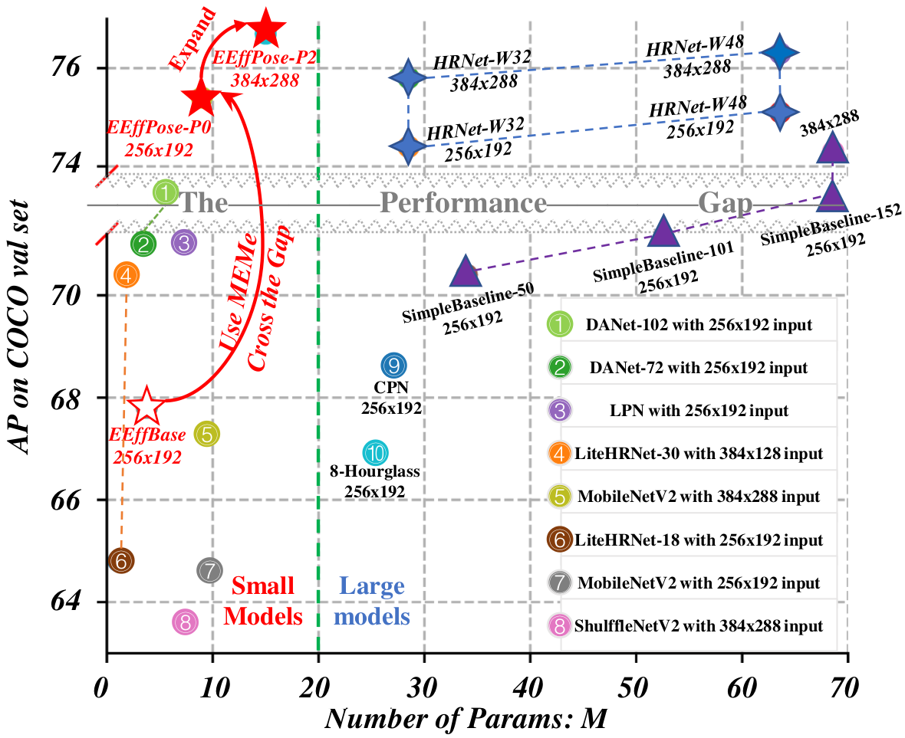

# MEMe: Use Mutually Enhanced Modeling Method in Human Pose Estimation Reaching the Best Trade-off between Complexity and Performance

## Introduction
This is an official pytorch implementation of [*MEMe: A Mutually Enhanced Modeling Method for Efficient and Effective Human Pose Estimation*](https://www.mdpi.com/1424-8220/22/2/632).
In this paper, a mutually enhanced modeling method (MEMe) is presented for human pose estimation, which focuses on enhancing lightweight model performance, but with low complexity. To obtain higher accuracy, a traditional model scale is largely expanded with heavy deployment difficulties. However, for a more lightweight model, there is a large performance gap compared to the former; thus, an urgent need for a way to fill it. Therefore, we propose a MEMe to reconstruct a lightweight baseline model, EffBase transferred intuitively from EfficientDet, into the efficient and effective pose (EEffPose) net, which contains three mutually enhanced modules: the Enhanced EffNet (EEffNet) backbone, the total fusion neck (TFNeck), and the final attention head (FAHead). Extensive experiments on COCO and MPII benchmarks show that our MEMe-based models reach state-of-the-art performances, with limited parameters. Specifically, in the same conditions, our EEffPose-P0 with 256 × 192 can use only 8.98 M parameters to achieve 75.4 AP on the COCO val set, which outperforms HRNet-W48, but with only 14% of its parameters.


## Environment
Our experiments are trained on 4 NVIDIA A100 GPUs withPytorch 1.9, Cuda 11.1, and Cudnn 8.0.5. 
For the system, it is Ubuntu 16.04 running on an Intel E5-2678v3@2.50GHzCPU and 64G RAM memory.

## Quick start
1. Install dependencies.
   ```
   conda create -n EffKPNet python=3.6
   source activate EffKPNet
   bash install.sh
   ```
2. Init output(training model output directory) and log(tensorboard log directory) directory:

   ```
   mkdir output
   ```

   Your directory tree should look like this:

   ```
   ${POSE_ROOT}
   ├── data
   ├── experiments
   ├── lib
   ├── output
   ├── tools
   ├── visualization
   ├── weights
   ├── install.sh
   ├── README.md
   └── requirements.txt
   ```

3. Download pretrained models from our model zoo(To be available after double blinding review)
   ```
   ${POSE_ROOT}
    `-- weights
        `-- eeffpose
            |-- coco
            |   |-- ablation
            |   |   |-- [000]eeffposep0_256x192_adam_lr1e-3/model_best.pth
            |   |   |-- [001]eeffposep0_256x192_adam_lr1e-3/model_best.pth
            |   |   |-- [010]eeffposep0_256x192_adam_lr1e-3/model_best.pth
            |   |   |-- [011]eeffposep0_256x192_adam_lr1e-3/model_best.pth
            |   |   |-- [100]eeffposep0_256x192_adam_lr1e-3/model_best.pth
            |   |   |-- [101]eeffposep0_256x192_adam_lr1e-3/model_best.pth
            |   |   |-- [110]eeffposep0_256x192_adam_lr1e-3/model_best.pth
            |   |-- eeffposep0_256x192_adam_lr1e-3/model_best.pth
            |   |-- eeffposep2_384x288_adam_lr1e-3/model_best.pth
            `-- mpii
                |-- eeffposep0_256x256_adam_lr1e-3/model_best.pth
                `-- eeffposep2_384x384_adam_lr1e-3/model_best.pth
   ```
   
### Data preparation
**For MPII data**, please download from [MPII Human Pose Dataset](http://human-pose.mpi-inf.mpg.de/). The original annotation files are in matlab format. We have converted them into json format, you also need to download them from [OneDrive](https://1drv.ms/f/s!AhIXJn_J-blW00SqrairNetmeVu4) or [GoogleDrive](https://drive.google.com/drive/folders/1En_VqmStnsXMdldXA6qpqEyDQulnmS3a?usp=sharing).
Extract them under {POSE_ROOT}/data, and make them look like this:
```
${POSE_ROOT}
|-- data
`-- |-- mpii
    `-- |-- annot
        |   |-- gt_valid.mat
        |   |-- test.json
        |   |-- train.json
        |   |-- trainval.json
        |   `-- valid.json
        `-- images
            |-- 000001163.jpg
            |-- 000003072.jpg
```

**For COCO data**, please download from [COCO download](http://cocodataset.org/#download), 2017 Train/Val is needed for COCO keypoints training and validation. We also provide person detection result of COCO val2017 and test-dev2017 to reproduce our multi-person pose estimation results. Please download from [OneDrive](https://1drv.ms/f/s!AhIXJn_J-blWzzDXoz5BeFl8sWM-) or [GoogleDrive](https://drive.google.com/drive/folders/1fRUDNUDxe9fjqcRZ2bnF_TKMlO0nB_dk?usp=sharing).
Download and extract them under {POSE_ROOT}/data, and make them look like this:
```
${POSE_ROOT}
|-- data
`-- |-- coco
    `-- |-- annotations
        |   |-- person_keypoints_train2017.json
        |   `-- person_keypoints_val2017.json
        |-- person_detection_results
        |   |-- COCO_val2017_detections_AP_H_56_person.json
        |   |-- COCO_test-dev2017_detections_AP_H_609_person.json
        `-- images
            |-- train2017
            |   |-- 000000000009.jpg
            |   |-- 000000000025.jpg
            |   |-- 000000000030.jpg
            |   |-- ... 
            `-- val2017
                |-- 000000000139.jpg
                |-- 000000000285.jpg
                |-- 000000000632.jpg
                |-- ... 
```

### Training and Testing

#### Testing on MPII dataset
For Single GPU training or testing, please remove '-m torch.distributed.launch --nproc_per_node=4'.

For EEffPose-P0
```
python -m torch.distributed.launch --nproc_per_node=4 tools/test_dist.py --cfg experiments/mpii/eeffpose/eeffposep0_256x256_adam_lr1e-3.yaml
```
For EEffPose-P2
```
python -m torch.distributed.launch --nproc_per_node=4 tools/test_dist.py --cfg experiments/mpii/eeffpose/eeffposep2_384x384_adam_lr1e-3.yaml
```
#### Training on MPII dataset
For EEffPose-P0
```
python -m torch.distributed.launch --nproc_per_node=4 tools/train_dist.py --cfg experiments/mpii/eeffpose/eeffposep0_256x256_adam_lr1e-3.yaml
```
For EEffPose-P2
```
python -m torch.distributed.launch --nproc_per_node=4 tools/train_dist.py --cfg experiments/mpii/eeffpose/eeffposep2_384x384_adam_lr1e-3.yaml
```
#### Testing on COCO val2017 dataset
For EEffPose-P0
```
python -m torch.distributed.launch --nproc_per_node=4 tools/test_dist.py --cfg experiments/coco/eeffpose/eeffposep0_256x192_adam_lr1e-3.yaml TEST.USE_GT_BBOX False
```
For EEffPose-P2
```
python -m torch.distributed.launch --nproc_per_node=4 tools/test_dist.py --cfg experiments/coco/eeffpose/eeffposep2_384x288_adam_lr1e-3.yaml TEST.USE_GT_BBOX False
```
#### Training on COCO train2017 dataset
For EEffPose-P0
```
python -m torch.distributed.launch --nproc_per_node=4 tools/train_dist.py --cfg experiments/coco/eeffpose/eeffposep0_256x192_adam_lr1e-3.yaml
```
For EEffPose-P2
```
python -m torch.distributed.launch --nproc_per_node=4 tools/train_dist.py --cfg experiments/coco/eeffpose/eeffposep2_384x288_adam_lr1e-3.yaml
```

### Visualization
#### Visualizing predictions on COCO val
```
python visualization/plot_coco.py --prediction visualization/keypoints_val2017_results[76.6].json --save-path visualization/results_coco
```
#### Visualizing predictions on MPII val
```
python visualization/plot_mpii.py --prediction visualization/pred[90.86].mat --save-path visualization/results_mpii
```
### Citation
If you use our code or models in your research, please cite with:
```
@article{MEME,
  author    = {Jie Li and
               Zhixing Wang and
               Bo Qi and
               Jianlin Zhang and
               Hu Yang},
  title     = {MEMe: {A} Mutually Enhanced Modeling Method for Efficient and Effective
               Human Pose Estimation},
  journal   = {Sensors},
  volume    = {22},
  number    = {2},
  pages     = {632},
  year      = {2022},
  url       = {https://doi.org/10.3390/s22020632},
  doi       = {10.3390/s22020632},
  timestamp = {Wed, 23 Feb 2022 17:40:46 +0100},
  biburl    = {https://dblp.org/rec/journals/sensors/LiWQZY22.bib},
  bibsource = {dblp computer science bibliography, https://dblp.org}
}
```
