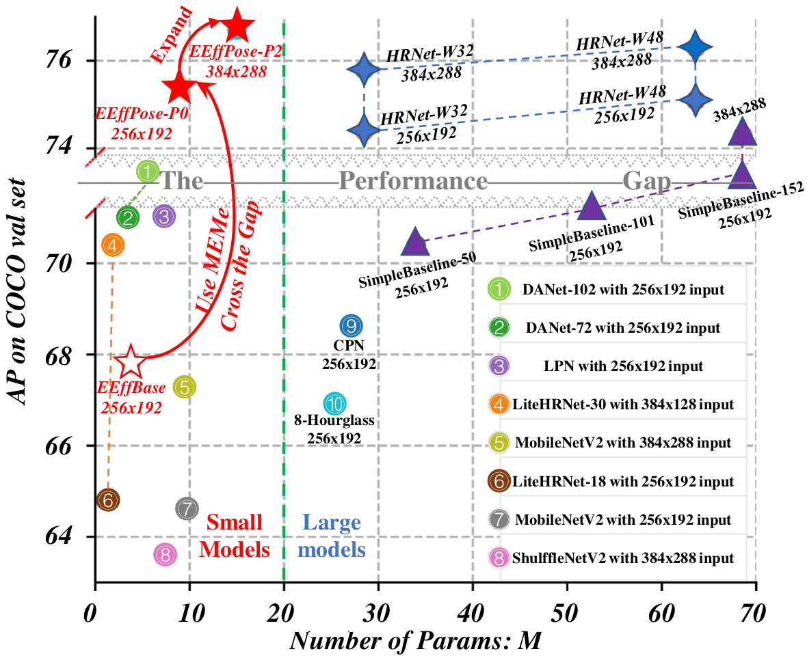

# MEMe: Use Mutually Enhanced Modeling Method in Human Pose Estimation Reaching the Best Trade-off between Complexity and Performance

## Introduction
This is an official pytorch implementation of [*MEMe: Use Mutually Enhanced Modeling Method in Human Pose Estimation Reaching the Best Trade-off between Complexity and Performance*](https://arxiv.org/abs/xxx.xxx).
In this paper, a Mutually Enhanced Modeling method (MEMe) is presented for the human pose estimation which focuses on enhancing lightweight models' performance but remaining low complexity. To obtain higher accuracy, traditional models' scale is largely expanding with heavy deployment difficulties. However, for more lightweight models, there is still a large performance gap compared to the former, calling urgently for the way to fill it.
Therefore, we propose the MEMe to reconstruct a lightweight baseline model, EffBase transferred intuitively from EfficientDet, into the Enhanced Efficient Pose (EEffPose) net, which contains three mutually enhanced modules: the Enhanced EffNet (EEffNet) backbone, the Total Fusion Neck (TFNeck), and the Final Attention Head (FAHead).
Firstly, in the EEffNet, the representation is mutually enhanced by Extended Convolutions and Cross-Scale Fusion, which makes the backbone more powerful.
Secondly, in the TFNeck, the features pyramid from the backbone is mutually enhanced by several repeated AddUp, MixUp and FixUp rather than some simple BiFPN, which ensures information flow flexibly among multi-scale features.
Finally, in the FAHead, the output is mutually enhanced by the Sigmoid and Point-Wise Multiplication to query and calibrate each scale output rather than averaging them simply, which captures the essence of the cross-attention mechanism achieving a better convergence.
Extensive Experiments on COCO and MPII benchmarks show that our MEMe-based models reach the state-of-the-art trade-off between complexity and performance. Specifically, in the same conditions, our EEffPose-P0 with 256x192 can use only 8.98M parameters to achieve 75.4 AP on the COCO val set, which outperforms HRNet-W48 but with only 14\% of its parameters.



## Environment
Our experiments are trained on 4 NVIDIA A100 GPUs withPytorch 1.9, Cuda 11.1, and Cudnn 8.0.5. For the system, itis Ubuntu 16.04 running on an Intel E5-2678v3@2.50GHzCPU and 64G RAM memory.

## Quick start
1. Install dependencies.
      ```
   bash install.sh
   ```
2. Init output(training model output directory) and log(tensorboard log directory) directory:

   ```
   mkdir output
   ```

   Your directory tree should look like this:

   ```
   ${POSE_ROOT}
   ├── data
   ├── experiments
   ├── lib
   ├── output
   ├── tools
   ├── visualization
   ├── weights
   ├── install.sh
   ├── README.md
   └── requirements.txt
   ```

3. Download pretrained models from our model zoo(To be available after double blinding review)
   ```
   ${POSE_ROOT}
    `-- weights
        `-- eeffpose
            |-- coco
            |   |-- ablation
            |   |   |-- [000]eeffposep0_256x192_adam_lr1e-3/model_best.pth
            |   |   |-- [001]eeffposep0_256x192_adam_lr1e-3/model_best.pth
            |   |   |-- [010]eeffposep0_256x192_adam_lr1e-3/model_best.pth
            |   |   |-- [011]eeffposep0_256x192_adam_lr1e-3/model_best.pth
            |   |   |-- [100]eeffposep0_256x192_adam_lr1e-3/model_best.pth
            |   |   |-- [101]eeffposep0_256x192_adam_lr1e-3/model_best.pth
            |   |   |-- [110]eeffposep0_256x192_adam_lr1e-3/model_best.pth
            |   |-- eeffposep0_256x192_adam_lr1e-3/model_best.pth
            |   |-- eeffposep2_384x288_adam_lr1e-3/model_best.pth
            `-- mpii
                |-- eeffposep0_256x256_adam_lr1e-3/model_best.pth
                `-- eeffposep2_384x384_adam_lr1e-3/model_best.pth
   ```
   
### Data preparation
**For MPII data**, please download from [MPII Human Pose Dataset](http://human-pose.mpi-inf.mpg.de/). The original annotation files are in matlab format. We have converted them into json format, you also need to download them from [OneDrive](https://1drv.ms/f/s!AhIXJn_J-blW00SqrairNetmeVu4) or [GoogleDrive](https://drive.google.com/drive/folders/1En_VqmStnsXMdldXA6qpqEyDQulnmS3a?usp=sharing).
Extract them under {POSE_ROOT}/data, and make them look like this:
```
${POSE_ROOT}
|-- data
`-- |-- mpii
    `-- |-- annot
        |   |-- gt_valid.mat
        |   |-- test.json
        |   |-- train.json
        |   |-- trainval.json
        |   `-- valid.json
        `-- images
            |-- 000001163.jpg
            |-- 000003072.jpg
```

**For COCO data**, please download from [COCO download](http://cocodataset.org/#download), 2017 Train/Val is needed for COCO keypoints training and validation. We also provide person detection result of COCO val2017 and test-dev2017 to reproduce our multi-person pose estimation results. Please download from [OneDrive](https://1drv.ms/f/s!AhIXJn_J-blWzzDXoz5BeFl8sWM-) or [GoogleDrive](https://drive.google.com/drive/folders/1fRUDNUDxe9fjqcRZ2bnF_TKMlO0nB_dk?usp=sharing).
Download and extract them under {POSE_ROOT}/data, and make them look like this:
```
${POSE_ROOT}
|-- data
`-- |-- coco
    `-- |-- annotations
        |   |-- person_keypoints_train2017.json
        |   `-- person_keypoints_val2017.json
        |-- person_detection_results
        |   |-- COCO_val2017_detections_AP_H_56_person.json
        |   |-- COCO_test-dev2017_detections_AP_H_609_person.json
        `-- images
            |-- train2017
            |   |-- 000000000009.jpg
            |   |-- 000000000025.jpg
            |   |-- 000000000030.jpg
            |   |-- ... 
            `-- val2017
                |-- 000000000139.jpg
                |-- 000000000285.jpg
                |-- 000000000632.jpg
                |-- ... 
```

### Training and Testing

#### Testing on MPII dataset using model zoo's models(To be available after double blinding review)
For EEffPose-P0
```
python -m torch.distributed.launch --nproc_per_node=4 tools/test_dist.py --cfg experiments/mpii/eeffpose/eeffposep0_256x256_adam_lr1e-3.yaml
```
For EEffPose-P2
```
python -m torch.distributed.launch --nproc_per_node=4 tools/test_dist.py --cfg experiments/mpii/eeffpose/eeffposep2_384x384_adam_lr1e-3.yaml
```
#### Training on MPII dataset
For EEffPose-P0
```
python -m torch.distributed.launch --nproc_per_node=4 tools/train_dist.py --cfg experiments/mpii/eeffpose/eeffposep0_256x256_adam_lr1e-3.yaml
```
For EEffPose-P2
```
python -m torch.distributed.launch --nproc_per_node=4 tools/train_dist.py --cfg experiments/mpii/eeffpose/eeffposep2_384x384_adam_lr1e-3.yaml
```
#### Testing on COCO val2017 dataset using model zoo's models(To be available after double blinding review)
For EEffPose-P0
```
python -m torch.distributed.launch --nproc_per_node=4 tools/test_dist.py --cfg experiments/coco/eeffpose/eeffposep0_256x192_adam_lr1e-3.yaml TEST.USE_GT_BBOX False
```
For EEffPose-P2
```
python -m torch.distributed.launch --nproc_per_node=4 tools/test_dist.py --cfg experiments/coco/eeffpose/eeffposep2_384x288_adam_lr1e-3.yaml TEST.USE_GT_BBOX False
```
#### Training on COCO train2017 dataset
For EEffPose-P0
```
python -m torch.distributed.launch --nproc_per_node=4 tools/train_dist.py --cfg experiments/coco/eeffpose/eeffposep0_256x192_adam_lr1e-3.yaml
```
For EEffPose-P2
```
python -m torch.distributed.launch --nproc_per_node=4 tools/train_dist.py --cfg experiments/coco/eeffpose/eeffposep2_384x288_adam_lr1e-3.yaml
```

### Visualization
#### Visualizing predictions on COCO val
```
python visualization/plot_coco.py --prediction visualization/keypoints_val2017_results[76.6].json --save-path visualization/results_coco
```
#### Visualizing predictions on MPII val
```
python visualization/plot_mpii.py --prediction visualization/pred[90.86].mat --save-path visualization/results_mpii
```
### Citation
If you use our code or models in your research, please cite with:
```
@inproceedings{8221,
  title={MEMe: Use Mutually Enhanced Modeling Method in Human Pose Estimation Reaching the Best Trade-off between Complexity and Performance},
  booktitle={AAAI},
  year={2022}
}
```
